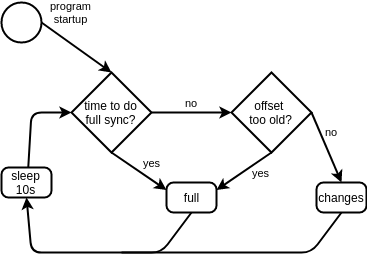

# Synced Database, an EcoStruxure IT Expert API sample program

Please make sure you also read the [general EcoStruxure IT Expert API README](../README.html).

# Executing the sample program

This sample shows how the API can be used to make a local database, that mirrors the alarm and inventory data from EcoStruxure IT Expert.
More precisely, the sample contains a small embedded database, that is continuously kept in sync with the data in the cloud.
The sample also contains an embedded web server, which will (by default) listen on localhost port `8080`.
The web server is used to serve a few web pages, that show the data in the local database.
Note, that the embedded database is (by default) setup to not write to disk, but just keeps all the data in memory. Furthermore, we've
chosen to exclude sensors from this example as the implementation mirrors the way it is done for the inventory data.

Run the sample with this command:

`java -jar public-api-sample-synced-database-1.0.0-SNAPSHOT.jar --apiKey=<your-api-key> --organizationId=<your-organization-id>`

If you want the web-server to listen on another port, set it with an extra parameter like this: `--server.port=9090`.

After having started the program, open [http://localhost:8080](http://localhost:8080) in your browser.

From the start page, you can:

* start a web-based SQL client, that allows you to query the data in the in-memory database, that contains the data fetched from the API
  (the start page shows some SQL statements you may want to try)
* or, you can navigate to pages showing either all alarms or all inventory objects currently in the local database
* and, from those pages you can click an ID to take a closer look at a specific device or location

# Design and implementation

The sample uses the [H2 Database Engine](https://www.h2database.com), which is a small relational database written in Java.
In the sample, H2 is run embedded within the application - which means H2 runs in the same process as the sample.
H2 is setup to not save any data to disk.
The file `./src/main/resources/application.properties` explains how to enable writing data to disk to keep the data in H2 across restarts.

The sample uses [Flyway](https://flywaydb.org) to create the database tables needed (Flyway is automatically activated by Spring Boot when
the program starts).
Flyway "remembers" changes it has already applied to a given database in a table called `flyway_schema_history`.
The SQL used to create the tables is in `src/main/resources/db/migration/V1.0__init.sql`.
Take a look at the tables it defines and the comments within the file.
Especially notice, that all the different types of inventory objects are saved into a single table.
Also note, that the sample doesn't have columns to store all the properties on devices - e.g. modelName, serialNumber and several more.

Code that handles reading from and writing to the database tables is located in repository classes.
The repository classes contain the SQL required to talk to the database, and also handles mapping between table rows and Java objects.

* `LastApiPollRepository` handles persistence of instances of the `LastApiPoll` class.
  This repository is used by the sample program to implement a sync-loop:

  

* `AlarmRepository` handles persistence of `Alarm` instances.
  The source code for the `Alarm` is generated by Maven from the Open API specification.
  See the generated code under this directory: `/target/generated-sources/swagger/src/gen/java/main`.

* `InventoryRepository` persists instances of `Device`, `Location` and `Organization` (all 3 are subtypes of `InventoryObject`).
  The source code for all those classes is also generated from the Open API specification.
  Notice how the repository's `RowMapper` maps database table rows to the 3 different inventory object subtypes depending on the value of
  the `discriminator` column.

The sample encapsulates the REST communication with the Public API in the `RestClient` class.
This class returns result instances of classes code generated based on the Open API specification.
This class uses the `apiKey` and `organizationId` you have provided.

The sample has a test class called `RestClientTest`, which isn't really a proper test (which is why it is `@Disabled`).
`RestClientTest` can be used to make calls to the real Public API - it writes the results received to the console.

The `RestClient` uses 4 API calls:

* `/rest/v1/organizations/{organizationId}/inventory` to get a full dump of all the inventory objects
* `/rest/v1/organizations/{organizationId}/inventory-changes/{deviceId}` to get info about new, changed and deleted inventory objects
* `/rest/v1/organizations/{organizationId}/alarms` to get a full dump of all active alarms and cleared alarms
  (cleared alarms will be available until approximately one week after they cleared - the duration may change, so don't rely on it)
* `/rest/v1/organizations/{organizationId}/alarm-changes/{offset}` to get info about changed alarms (alarms are not deleted)

The central piece of the sample is the `FetchEngine`, which is the most important part to understand.
Its relationship with the other core classes are shown in the illustration below:

```
FetchTimer ---> FetchEngine ---+---> RestClient
                               |
                               +---> LastApiPollRepository
                               |
                               +---> InventoryObjectRepository
                               |
                               `---> AlarmRepository
```

As shown, the `FetchEngine` has a reference to both the `RestClient` and to each of the 3 repositories.
The illustration also shows, that the `FetchTimer` has a reference to the `FetchEngine`.

The `FetchTimer` runs a background thread, that asks the `FetchEngine` to retrieve data from the Public API every 10 seconds.

The `FetchEngine` uses the `LastApiPollRepository` to "remember" when it last made a _full read_, when it last made a _changes read_, and
the _latest offset_ it has gotten back from a previous read.
Based on the information stored in `LastApiPoll`, the `FetchEngine` then decides to either makes a _full read_ or a _changes read_, and
stores the data retrieved into either the `AlarmRepository` or the `InventoryObjectRepository`.
The `FetchEngine` also updates the `LastApiPoll` with a new timestamp and offset.

Note: Changes to alarms / inventory objects are written to the database **in the same database transaction** as the changes to the
`LastApiPoll` instance, thus ensuring that the database changes are either all committed or all rolledback.
This happens because of the sample using Spring Boot's support for transactions (specifically the `@Transactional` annotation on the
methods `fetchInventoryObjects()` and `fetchAlarms()` in the `FetchEngine` class).

Together the `FetchTimer` and the `FetchEngine` implements the sync-loop pictured previously.

The sample program exposes a few web pages using an embedded web-server.
The implementation of the web pages is not important when learning about the Public API.
The dynamic pages are rendered using a combination of Spring Web MVC controllers (classes annotated with `@Controller`) and the
[Thymeleaf](https://www.thymeleaf.org/) template engine.
Below is an overview of the parts implementing the web UI:

* Static files are located in `/src/main/resources/static`
* The class `AlarmController` implements the logic behind the alarm overview page and fetches the data needed by the page.
  The page is rendered using this template: `/src/main/resources/templates/alarm-list.html`
* The class `InventoryObjectController` implements the logic behind two pages:
  - The inventory overview page, which is rendered by the template: `/src/main/resources/templates/inventory-object-list.html`

  - The inventory object details page, that renders the tree in which the given inventory object is a node.
    It is rendered by the template: `/src/main/resources/templates/inventory-object-details.html`.
    How the controller builds the tree, is probably the most interesting part of the UI code, which happens in the `inventoryObject`
    method located in `InventoryObjectController`.

The classes in the sample are tested by [JUnit 5](https://junit.org/junit5/) tests, which are located in `/src/test`.
